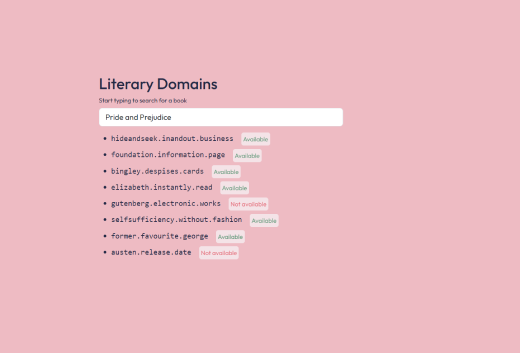

# Literary.Domains

Great domain name ideas from great literary work.

Try it at [literary.domains](https://literary.domains/).

<!-- and learn more about the project [on my blog](https://stefanbohacek.com/project/todo).-->

## Development

1. Install dependencies:

```sh
pip install -r requirements.txt
```

2. Optionally enable debug mode.

```sh
export FLASK_DEBUG=1
```

3. Start the local development server.

```sh
flask run
```
